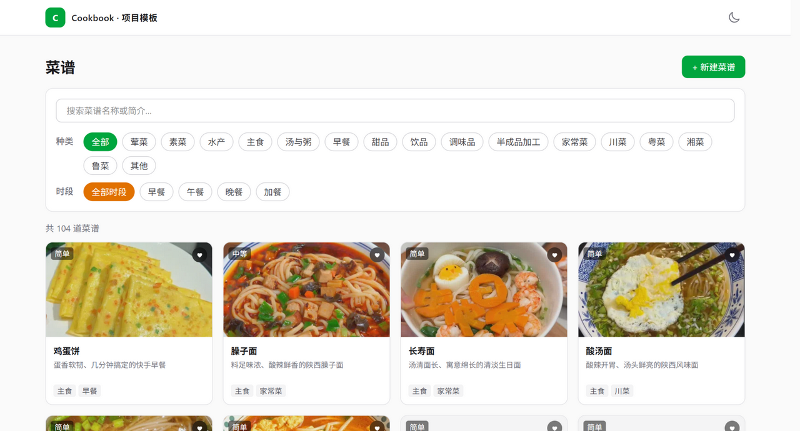
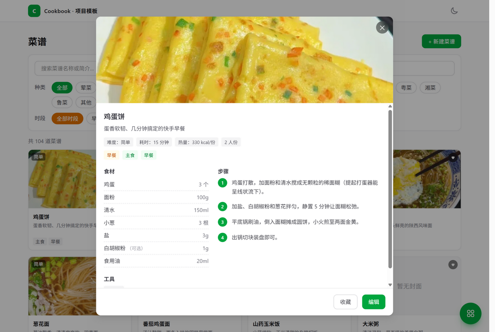
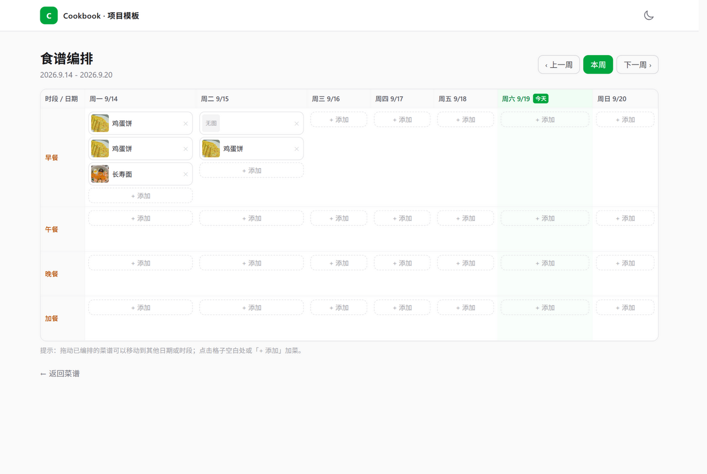
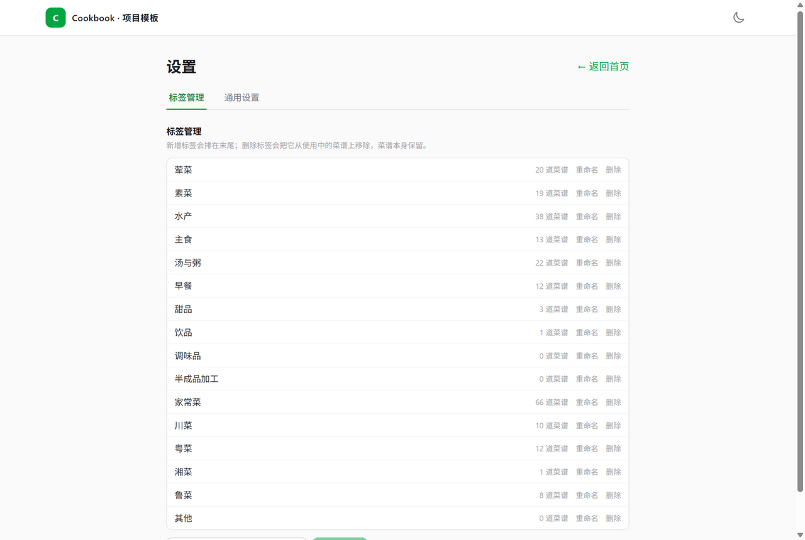

<div align="center">

# 🍳 Cookbook · 家庭菜谱管理

**自托管的个人 / 家庭菜谱中心：菜谱管理 · 多收藏夹 · 家庭成员口味 · 每周菜单编排**

Go 1.26 + GoFrame v2 后端 · Nuxt 4 前端 · 单镜像一键部署 · PostgreSQL / SQLite 双支持

[](https://github.com/z91300/cookbook/actions/workflows/build.yml)


[](./LICENSE)

如果这个项目对你有帮助，欢迎点一个 **Star ⭐** 支持一下，也欢迎提 Issue / PR 交流～

</div>

<div align="center">

| 首页 · 卡片墙与筛选 | 菜谱详情 · 结构化步骤图文 |
| :---: | :---: |
|  |  |
| **每周菜单编排 · 周历拖拽** | **标签管理 · 用量统计** |
|  |  |

</div>

---

## ✨ 功能特性

### 🥘 菜谱管理

- **卡片墙浏览**：封面图 + 一句话简介 + 难度角标 + 分类标签，无限滚动分页加载
- **多维筛选**：关键词搜索（菜名 / 简介）、分类标签、用餐时段（早餐 / 午餐 / 晚餐 / 加餐），实时显示结果数，一键清除筛选
- **结构化详情**：难度 / 耗时 / 热量 / 人份 / 适合时段一目了然；食材清单（名称 + 用量 + 可选标记）、所需炊具、分步骤图文（每步可配多图）、小贴士
- **全功能编辑器**：食材行与步骤均支持**拖拽排序**，步骤支持多图上传，炊具从预设清单勾选
- **右键快捷菜单**：复制 AI 生图提示词（按设置页模板逐菜谱渲染后进剪贴板）、编辑、删除（带二次确认）
- **亮 / 暗色主题**：顶栏一键切换，也可跟随系统偏好

### ⭐ 多收藏夹收藏

- 任意创建多个收藏夹，同一道菜可**同时收进多个收藏夹**；卡片右上角爱心实时显示被收藏次数
- 收藏夹页支持新建 / 重命名 / 删除，展开即可浏览夹内菜谱并管理

### 👨‍👩‍👧 家庭成员

- 记录成员角色（预置 + 自定义）与口味、忌口、过敏等饮食备注
- 为「按家人口味编排每周菜单」提供数据基础

### 📅 每周菜单编排

- **周历视图** × 每日四餐段（早 / 午 / 晚 / 加餐），一格可排多道菜
- 上 / 下一周切换、今天高亮
- 内置菜谱选择器（带搜索）快速加菜，已排条目可**拖拽换日 / 换餐段**
- 每条编排可单独填写份量与备注

### 🏷️ 标签 & ⚙️ 设置

- 标签完全由自己维护（库中不预置数据）：新增、重命名、删除（删除前提示有多少菜谱正在使用，确认后从这些菜谱移除该标签、菜谱本身保留），**设置页拖拽 ⠿ 即可调整顺序**，排序写库并在首页标签栏同步生效
- 通用设置为 key-value 存储，内置 **AI 生图提示词模板**：`{recipe.*}` 变量占位、推荐模板一键填入，在菜谱右键「复制生图提示词」时自动替换为对应菜谱内容

### 🖼️ 图片与附件

- 上传的栅格图自动重编码为 **WebP**（无体积收益时保留原格式），内容 `sha256` 去重
- 文件本体直接存数据库（PostgreSQL `BYTEA`），**备份 = 全库备份**，无需单独的附件磁盘卷
- 列表小图统一走 `?w=360` 缩略图（服务端内存缓存 + ETag 长缓存），打开快、流量省

### 🧰 工程特性（开发者向）

- GoFrame v2 自动生成 **OpenAPI**（`/api.json`）与 Swagger UI，接口即文档
- 全链路代码生成：`gf gen ctrl / service / dao` → **worma** 据 OpenAPI 生成前端 TS 客户端，前后端类型天然一致
- 内置统一响应信封、多值查询参数归一、分页模型、无限加载、弹窗滚动锁与移动端返回手势关弹窗等通用设施
- **单镜像部署**：Nuxt SSR 与 Go API 同容器双端口，GitHub Actions 自动构建推送 GHCR，CI 零 Secret 依赖

## 🧱 技术栈

| 层 | 技术 | 说明 |
| --- | --- | --- |
| 后端 | Go 1.26 / GoFrame v2.10 | HTTP 服务、参数校验、OpenAPI / Swagger 自动生成 |
| 数据库 | PostgreSQL 18（或 SQLite） | 结构由幂等脚本 `manifest/init.sql` 维护 |
| 前端 | Nuxt 4 / @nuxt/ui v4 / TailwindCSS v4 | SSR 渲染 |
| API 客户端 | wormajs | 读取后端 OpenAPI 自动生成 TS 请求代码 |

## 🚀 快速开始

### 方式一：Docker 一键部署（推荐）

镜像：`ghcr.io/z91300/cookbook:latest`，单容器同时运行前端 SSR（3000）与后端 API（8000）。

**SQLite（最简单，本地单机）**

```bash
git clone https://github.com/z91300/cookbook.git
cd cookbook
DB_TYPE=sqlite docker compose up -d --wait
```

**PostgreSQL**

```bash
DB_TYPE=postgres DB_HOST=<数据库地址> DB_PORT=5432 \
DB_USER=root DB_PASSWORD=<密码> DB_NAME=cookbook \
  docker compose up -d --wait
```

启动后访问：

- 前端：`http://127.0.0.1:8080`（`COOKBOOK_WEB_PORT` 可改）
- API：`http://127.0.0.1:8000`（`COOKBOOK_API_PORT` 可改）

> 数据存在哪里？
> - PostgreSQL 模式：全部在外部数据库；SQLite 模式：库文件在 `DB_DATA_PATH`（默认 `/data/cookbook.db`，建议挂卷持久化）。
> - 图片等附件二进制直接入库，没有额外的附件目录，备份只需备库。

### 方式二：本地开发

前置要求：Go 1.26+、Node.js 20+ / pnpm、可访问的 PostgreSQL（或改用 SQLite）。

```bash
# 1. 后端（端口 8000）：复制配置模板并填入数据库链接
cp config.example.yaml config.yaml
psql "<你的数据库链接>" -f manifest/init.sql   # 初始化表结构（幂等脚本）
go run .

# 2. 前端（端口 3000，/api 自动代理到 127.0.0.1:8000）
cd web
pnpm install
pnpm dev
```

访问 `http://127.0.0.1:3000`。首次启动可在首页「+ 新建菜谱」添加第一道菜。

### API 文档

后端启动后可直接访问：

| 地址 | 说明 |
| --- | --- |
| `/api.json` | OpenAPI 3 规范（前端客户端即由此生成） |
| `/swagger` | Swagger UI 在线调试 |
| `/hello` | 健康检查 |

## ⚙️ 环境变量

数据库连接运行时注入（装配逻辑 `internal/cmd/dbenv.go`），**镜像内无任何配置文件与凭据**：

| 变量 | 说明 | 默认 |
| --- | --- | --- |
| `DB_TYPE` | `postgres`（别名 `pg`）或 `sqlite` | `postgres` |
| `DB_HOST` / `DB_PORT` / `DB_USER` / `DB_PASSWORD` / `DB_NAME` | PostgreSQL 连接参数 | 5432 / root / cookbook |
| `DB_DATA_PATH` | SQLite 库文件路径（`DB_TYPE=sqlite` 时） | `/data/cookbook.db` |
| `COOKBOOK_IMAGE` | compose 使用的镜像 | `ghcr.io/z91300/cookbook:latest` |
| `COOKBOOK_WEB_PORT` | 前端 SSR 宿主机端口 | `8080` |
| `COOKBOOK_API_PORT` | 后端 API 宿主机端口 | `8000` |

## 🗂️ 目录结构

```
cookbook/
├── main.go                  # 后端入口
├── api/                     # 接口定义层（每资源一个目录，v1 版本子目录）
├── internal/
│   ├── cmd/                 # 启动、路由注册与 DB 环境变量装配
│   ├── controller/          # 控制器：组合 api 层接口并转发 logic
│   ├── logic/               # 业务逻辑实现
│   ├── model/               # 请求/响应/实体模型（字段唯一定义点）
│   ├── handler/             # 全局中间件（统一响应信封 / 多值参数归一）
│   ├── dao/  service/       # 数据访问与服务接口（gf gen 生成）
│   └── ...
├── manifest/init.sql        # 数据库结构初始化（幂等，只建结构不预置业务数据）
├── scripts/                 # 镜像构建 / 自测脚本
├── web/                     # Nuxt 4 前端
│   ├── app/pages/           # 首页 / 收藏夹 / 成员 / 编排 / 设置
│   ├── app/api/             # worma 生成的 TS 客户端
│   └── app/composables/     # 无限加载、弹窗返回手势等
└── .github/workflows/       # CI：构建镜像 → 推送 GHCR
```

## 🗺️ Roadmap

- [ ] 用户账号体系（`users` 表结构已预留）
- [ ] AI 生成菜谱（`recipes.source=ai`、`ai_generations` 记录表已预留）
- [ ] 结合家庭成员口味 / 忌口，智能推荐每周菜单
- [ ] 从编排菜单一键生成采购清单

## 🤝 参与贡献

欢迎提 Issue 与 PR！项目约定（分层职责、operationId 规范、代码生成流程、字段唯一定义点等）集中在 [AGENTS.md](AGENTS.md)，人工开发与 AI 协作共同遵守，动手前建议先读一遍。

## 📄 开源协议

本项目基于 **[GNU AGPL-3.0](LICENSE)** 协议开源：

- 个人使用、学习、修改、自托管部署完全自由
- 若基于本项目搭建网络服务或二次开发并对外提供，需按同一协议开源相应源码（AGPL-3.0 第 13 条网络条款）
- 分发时请保留原始版权与许可声明

## ⭐ Star History

觉得不错的话，点个 Star 让我知道 👇

[](https://star-history.com/#z91300/cookbook&Date)

---

<div align="center">

**Cookbook** · 用技术管理一日三餐 🍚

</div>
